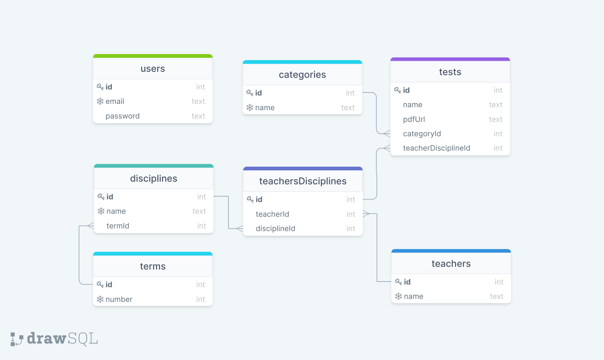

<p align="center">
  
</p>
<h1 align="center">RepoProvas API</h1>
<h2 align="center">Built with</h2>
<div align="center">
  
  
    
  
  
  

</div>

## General Info

RepoProvas is an API for sharing exams between students. You can

&Rarr; Do **authentication** (signin/signup);

&Rarr; **Register** new tests;

&Rarr; **Get** the registered tests by **disciplines** or **teachers**.

## Table of Contents

- [API Reference](#api-reference)
  - [SignUp](#signup)
  - [SignIn](#signin)
  - [Create a Test](#create-a-test)
  - [Get Tests By Disciplines](#get-all-tests-by-discipline)
  - [Get Tests By Teachers](#get-all-tests-by-teachers)
- [Database](#database)

## API Reference

### SignUp

```bash
POST /signup
```

#### Request

- **Body**:

```js
{
  "email": "email@g.com", // string (REQUIRED)
  "password": "123" // string (REQUIRED)
  "confirmPassword": "123" // string (must to be equal "password")
}
```

> ⚠ `confirmPassword`: must to be equal password field.

#### Response

- **Status:** `201 Created`

```json
"Created new user!"
```

### SignIn

```bash
POST /signin
```

#### Request

- **Body**:

```json
{
  "email": "l@g.com", // string (REQUIRED)
  "password": "123" // string (REQUIRED)
}
```

#### Response

- **Status:** `202 Accepted`

```json
{
  "token": "here is a hyper mega blaster secret token"
}
```

### Create a Test

```bash
POST /test
```

#### Request

- **Body**:

```js
{
  "name": "prova de cálculo I",      // string (REQUIRED)
  "pdfUrl": "https://provaus.com/", // valid url (REQUIRED)
  "category": "Recuperação",       // string (REQUIRED)
  "discipline": "React",          // string (REQUIRED)
  "teacher": "Diego Pinho"       // string (REQUIRED)
}
```

- **Headers**

```json
{
  "Authorization": "Bearer {{TOKEN}}" // TOKEN IS EMITED BY JWT
}
```

#### Response

- **Status:** `201 Created`

```js
{
  "id": 2,
  "name": "prova de cálculo I",
  "pdfUrl": "https://provaus.com/",
  "categoryId": 3,
  "teacherDisciplineId": 3
}
```

### Get all Tests By Discipline

```bash
GET /test/discipline
```

#### Request

**Headers**

```json
{
  "Authorization": "Bearer {{TOKEN}}" // TOKEN IS EMITED BY JWT
}
```

#### Response

- **Status:** `200 OK`

```js
[
  {
    id: 1,
    number: 1,
    Disciplines: [
      {
        id: 1,
        name: "HTML e CSS",
        TeachersDisciplines: [
          {
            teacher: {
              id: 1,
              name: "Diego Pinho",
            },
            Tests: [],
          },
        ],
      },
      {
        id: 4,
        name: "Humildade",
        TeachersDisciplines: [
          {
            teacher: {
              id: 2,
              name: "Bruna Hamori",
            },
            Tests: [],
          },
        ],
      },
    ],
  },
  {
    id: 2,
    number: 2,
    Disciplines: [
      {
        id: 2,
        name: "JavaScript",
        TeachersDisciplines: [
          {
            teacher: {
              id: 1,
              name: "Diego Pinho",
            },
            Tests: [],
          },
        ],
      },
      {
        id: 5,
        name: "Planejamento",
        TeachersDisciplines: [
          {
            teacher: {
              id: 2,
              name: "Bruna Hamori",
            },
            Tests: [],
          },
        ],
      },
    ],
  },
  {
    id: 3,
    number: 3,
    Disciplines: [
      {
        id: 3,
        name: "React",
        TeachersDisciplines: [
          {
            teacher: {
              id: 1,
              name: "Diego Pinho",
            },
            Tests: [
              {
                id: 1,
                name: "prova de 16",
                pdfUrl: "https://provaus.com/",
                category: {
                  id: 3,
                  name: "Recuperação",
                },
              },
              {
                id: 2,
                name: "prova de 1",
                pdfUrl: "https://provaus.com/",
                category: {
                  id: 3,
                  name: "Recuperação",
                },
              },
            ],
          },
        ],
      },
      {
        id: 6,
        name: "Autoconfiança",
        TeachersDisciplines: [
          {
            teacher: {
              id: 2,
              name: "Bruna Hamori",
            },
            Tests: [],
          },
        ],
      },
    ],
  },
  {
    id: 4,
    number: 4,
    Disciplines: [],
  },
  {
    id: 5,
    number: 5,
    Disciplines: [],
  },
  {
    id: 6,
    number: 6,
    Disciplines: [],
  },
];
```

### Get all Tests By Teachers

```bash
GET /test/teacher
```

#### Request

**Headers**

```json
{
  "Authorization": "Bearer {{TOKEN}}" // TOKEN IS EMITED BY JWT
}
```

#### Response

- **Status:** `200 OK`

```js
[
  {
    id: 1,
    name: "Diego Pinho",
    TeachersDisciplines: [
      {
        discipline: {
          id: 1,
          name: "HTML e CSS",
        },
        Tests: [],
      },
      {
        discipline: {
          id: 2,
          name: "JavaScript",
        },
        Tests: [],
      },
      {
        discipline: {
          id: 3,
          name: "React",
        },
        Tests: [
          {
            id: 1,
            name: "prova de 16",
            pdfUrl: "https://provaus.com/",
            category: {
              id: 3,
              name: "Recuperação",
            },
          },
          {
            id: 2,
            name: "prova de 1",
            pdfUrl: "https://provaus.com/",
            category: {
              id: 3,
              name: "Recuperação",
            },
          },
        ],
      },
    ],
  },
  {
    id: 2,
    name: "Bruna Hamori",
    TeachersDisciplines: [
      {
        discipline: {
          id: 4,
          name: "Humildade",
        },
        Tests: [],
      },
      {
        discipline: {
          id: 5,
          name: "Planejamento",
        },
        Tests: [],
      },
      {
        discipline: {
          id: 6,
          name: "Autoconfiança",
        },
        Tests: [],
      },
    ],
  },
];
```

## Database

The Database was created using the following schema:



To create it, it was used **Postgres** and **Prisma**.

## Author

[](https://github.com/lucasborges24)
[![LinkedIn][linkedin-shield]][linkedin-url]
[](https://www.instagram.com/lucas__fisica/)

<!-- MARKDOWN LINKS & IMAGES -->

[linkedin-shield]: https://img.shields.io/badge/-LinkedIn-black.svg?style=for-the-badge&logo=linkedin&colorB=blue
[linkedin-url]: https://www.linkedin.com/in/lucas-b-barbosa-12a157216/
